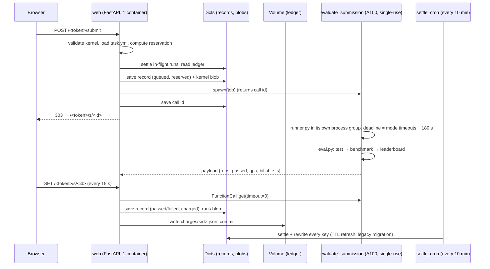

# Sitemap

Everything reachable on a deployed site, everything running behind it, and
the shape of the data. `<link>` is `https://<workspace>--sutro-mnist-submit-web.modal.run/<token>`.

## Pages (HTML)

| Method | Path | What it shows | Notes |
| --- | --- | --- | --- |
| GET | `/` | `nothing here` | 404 on purpose; the site has no public landing page |
| GET | `/<token>` | **Index**: budget bar, the submission form, the table of all submissions | the form is prefilled with the template kernel |
| POST | `/<token>/submit` | handles the form | on success 303 → the new submission's page; on rejection re-renders the index with the reason and the typed kernel (400); 413 if the body is over 320 KB |
| GET | `/<token>/s/<id>` | **Submission detail**: status, result table, per-step table, raw evaluator output per step, stderr (collapsed), the kernel | refreshes itself every 15 s while the run is queued or running |
| GET | `/<token>/s/<id>/source` | the kernel as plain text | |
| GET | `/<token>/login` | redirects to GitHub's consent screen | 303 straight back to the index when sign-in is off |
| GET | `/<token>/logout` | clears the session cookie, 303 to the index | |
| GET | `/auth/callback` | finishes the GitHub round trip, sets the cookie, 303 to the index | **not** behind the token, on purpose: see below. 404 when sign-in is off |

Any path whose first segment is not the token (including non-ASCII ones)
returns 404; a known path with the wrong method returns 405. The token is
compared in constant time.

`/auth/callback` is the one route outside the token. That is deliberate: the
`redirect_uri` sent to GitHub is logged by GitHub, so putting the secret link
in it would hand the link over. The callback carries no token, and what it
grants -- a session cookie -- is worthless to anyone who does not already have
the link. The OAuth `state` is HMAC-signed with a server-side key and expires
after 10 minutes, so the callback only accepts a round trip this site started.

### The form (`POST /<token>/submit`, multipart)

| Field | Values |
| --- | --- |
| `name` | free text, up to 80 characters, shown in the table |
| `band` | `mnist-medium-2pct`, `-3pct`, `-5pct`, `-8pct`, `-12pct` |
| `mode` | `test` (1 draw, loose gate), `benchmark` (3 timed draws, no hold-out), `leaderboard` (test + benchmark + the ranked 11-draw protocol with hold-out) |
| `source` | the kernel text (textarea) |
| `file` | optional upload; when present it replaces `source` |

Rejections that cost nothing: empty kernel, syntax error, no `custom_kernel`
defined, kernel over 256 KB, unknown band or mode, budget cap would be
exceeded, 8 runs already queued.

### What the detail page shows once a run is settled

- Verdict (PASS/FAIL), and for leaderboard runs the ranked number: mean
  time per call over the ranked draws, with std/best/median.
- Accuracy as correct/total with the count required for the band; correct
  per draw; the Fashion-MNIST hold-out accuracy and time.
- The failure reason when there is one (the evaluator's own message).
- Hardware line: GPU model, torch, CUDA, harness version.
- Cost: dollars charged for the measured container seconds, the reservation,
  and an "overran the reservation" flag if that ever happens.
- Steps table (`test`, `benchmark`, `leaderboard`: pass/fail, exit code,
  seconds), then each step's raw `key: value` output and stderr.

## JSON API

| Method | Path | Returns |
| --- | --- | --- |
| GET | `/<token>/api/submissions` | `{"ledger": {...}, "submissions": [record, ...]}` newest first |
| GET | `/<token>/api/s/<id>` | one record |

Both settle in-flight runs before answering, so polling either is enough to
drive a submission to its verdict (that is what `scripts/smoke.py` does).

Ledger object:

```json
{"budget_usd": 50.0, "charged_usd": 0.2983, "reserved_usd": 0.0,
 "committed_usd": 0.2983, "remaining_usd": 49.7017, "inflight": 0}
```

Record object (public fields; `seed`, `call_id` and `last_settle_error` are
stripped):

| Field | Meaning |
| --- | --- |
| `id` | `YYYYMMDD-HHMMSS-<6 hex>`, UTC, sortable |
| `created_at`, `finished_at` | ISO-8601 UTC |
| `name`, `band`, `mode` | as submitted |
| `status` | `queued` → `passed` \| `failed` \| `error` |
| `reserved_usd` | worst-case cost reserved when queued |
| `deadline_s` | the hard deadline the worker enforced on the whole evaluation |
| `charged_usd` | measured cost once settled; for `error` the reservation, or the whole container life after a Modal container-limit timeout |
| `overrun_usd` | `max(0, charged - reserved)` |
| `billable_s` | container seconds the charge is based on |
| `gpu` | e.g. `NVIDIA A100-SXM4-40GB` |
| `summary` | see below |
| `error` | infrastructure error text (status `error` only) |
| `settle_failures` | consecutive polling failures, reset on success |

`summary` fields: `verdict`, `steps` (list of `[step, passed, exit_code,
seconds]`), `last_step`, `ranked_step` (`leaderboard` or `benchmark`),
`mean_ms`, `std_ms`, `best_ms`, `median_ms`, `draws`, `accuracy_pct`,
`correct`, `total`, `required`, `per_draw`, `holdout_pct`, `holdout_correct`,
`holdout_required`, `holdout_ms`, `message` (test mode), `error`, `system`
(`harness`, `torch`, `cuda`, `device`, `python`, …), `gpu`. Only `verdict`,
`steps`, `last_step`, `system`, `gpu` and `error` are always present; the
ranked fields, the `holdout_*` fields and `message` are **absent** when the
evaluator did not produce them (read them with `.get()`), and a field that
was produced but unparseable is `null`. Records in status `error` have no
`summary`, `billable_s` or `gpu` at all.

Status meanings: `passed` and `failed` are the evaluator's verdict, charged
measured container time (a run killed by the worker's own deadline is a
`failed` run whose `summary.error` names the deadline). `error` means the run
could not be completed or read (container died, cancelled, result
unreadable, call id lost) and the reservation was charged, except that a run
which hit Modal's 2400 s container limit is charged the whole container life
(`BACKSTOP_USD`, about $2.05).

## Behind the site (Modal)



| Function | Decorator facts |
| --- | --- |
| `web` | `@modal.asgi_app()`, `max_containers=1`, `@modal.concurrent(max_inputs=20)`, `scaledown_window=300`, Volume mounted at `/ledger` |
| `evaluate_submission` | `gpu="A100"`, `cpu=2`, `memory=8192`, `timeout=2400`, `max_containers=1`, `single_use_containers=True`, `restrict_modal_access=True`, `block_network=True`, `retries=0`, image = `run_modal.image` (datasets baked in) |
| `settle_cron` | `schedule=modal.Period(minutes=10)`, Volume mounted |

Owner commands (local entrypoints, `uvx modal run web/app.py::<name>`):
`link`, `status`, `set_budget --usd N`, `cancel --sid ID`, `rotate_token`,
`export --output FILE`.

## State

| Object | Key | Value |
| --- | --- | --- |
| Dict `sutro-mnist-submit-records` | `config:token` | the secret path token |
| | `config:budget_usd` | the cap, when changed after deploy |
| | `sub:<id>` | the record (small; no kernel text, no evaluator output) |
| Dict `sutro-mnist-submit-records-blobs` | `src:<id>` | kernel text |
| | `runs:<id>` | full evaluator output per step (`result`, `stdout`, `stderr` tails) |
| Volume `sutro-mnist-submit-ledger` | `charges/<id>.json` | `{"id", "charged_usd", "at", ...}`, written once per settled run |

The ledger's `charged_usd` is `max(sum over records, sum over Volume files)`;
`reserved_usd` is the sum over `queued` records. The cron rewrites every Dict
key every 10 minutes so the Dict's 7-day idle expiry never fires while the
app is deployed, and moves any pre-blob-layout record into the new layout.

## Files

| Path | Role |
| --- | --- |
| `web/app.py` | routes, HTML, ledger, `Site` class, worker, cron, entrypoints |
| `web/runner.py` | lifts the baked datasets into RAM, runs `run_modal.evaluate()`, writes the payload |
| `run_modal.py` | the harness runner: `load_task`, `evaluate`, `run_one`, the A100 image |
| `eval.py`, `utils.py`, `mnist_data.py`, `task.py`, `reference.py` | the evaluator |
| `submission.py` | the template shown in the form |
| `mnist-medium-*/task.yml` | per-band cases and timeouts (reservations derive from these) |
| `submissions/*.py` | reference kernels used by the smoke tests |
| `scripts/smoke.py` | end-to-end check against a deployed site |
| `tests/test_web.py`, `tests/test_eval.py` | unit tests |
